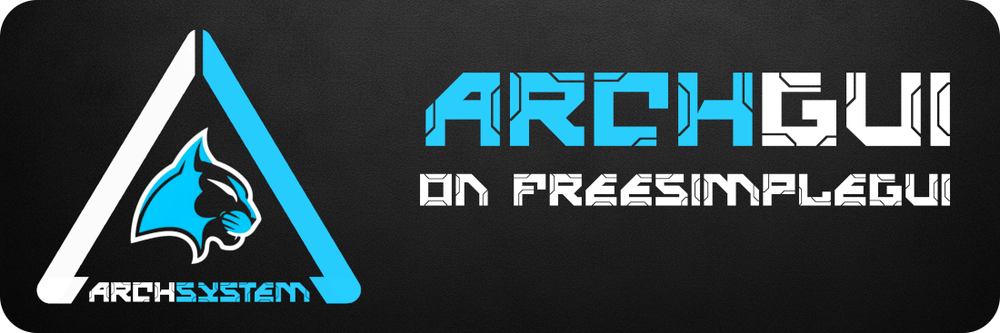

  
Archgui est un module basé sur `FreeSimpleGUI`. 
Il permet la création de modèle de fenêtre à partir d’un fichier `.json` et d’un fichier `.py` pour les events
correspondant à ce modèle. Le but de ce module est de simplifier la création d’application nécessitant
la gestion de plusieurs fenêtres.

À terme une `GUI` basé sur ce module sera disponible pour la création des fenêtres. 
Il ne sera plus nécessaire d’éditer à la main les fichiers `.json` qui est la partie la plus chronophage,
le gain de temps devrait etre significatif entre une application développée depuis `FreeSimpleGUI` et 
une développée avec la surcouche `ArchGUI`.

<br/>

⚠️ Le development de ce module est en cours. 
Ce n’est pour le moment qu’une demonstration incomplète. 
Si vous souhaitez tester ce module, il est préférable de le faire dans un environnement dédié.

<br/>

## 😊 Fonctionnalités principales :
- Dimensionnement et positionnement simplifié des fenêtres.
- Dimensionnement et positionnement des fenêtres relatif à une autre fenêtre ou à la résolution du moniteur.
- Création de fenêtre sur la base d’un fichier `.json`.
- Les fenêtres sont gérées comme modèle et peuvent être dupliqué et affiché à volonté.
- Update simple des éléments d’une fenêtre.

<br/>

## 💻 Fonctionne sous les OS :
- Ubuntu 24.04 
- Windows 11 (en cours de test)

<br/>

## 🛠️ Nécessite :
- Anaconda
- Python >= 3.12

<br/>

## 🛠️ Installation :

#### Création de l'environnement via Conda :
```bash
conda create -n 'archgui_demo' python=3.12 anaconda
```

#### Utilisation de l'environnement :
```bash
conda activate 'archgui_demo'
```

#### Ubuntu 24.04 :
```bash
conda install -c conda-forge nomkl pynput screeninfo
conda remove mkl mkl-service

pip install freesimplegui
```

<br/>

## 🛠️ Test minimal :

#### Dossier initial:
```
.
├── archgui
├── archgui_events
├── archgui_windows
│   └── test.json
└── test.py
```

#### Fichier: archgui_windows/test.json :
```json
{
    "parameters": {
        "location_x": "50%",
        "location_y": "50%",
        "width": 516,
        "height": 133
    },
    "items": [[
        [{"t": "column", "k": "column_1", "p": [[0, 0], [0, 5]], "sc": false, "scvo": false}, [
            [
                [{"t": "frame", "k": "frame_1", "v": " Frame 1 "}, [
                    [
                        [{"t": "column", "k": "column_11", "p": [[5, 5], [0, 10]] }, [
                            [
                                [{"t": "label", "k": "label_1", "v": "label_1", "s": [14, 1]}],
                                [{"t": "in_line", "k": "in_line_1", "v": "in_line_1", "s": [20, 1]}],
                                [{"t": "button", "k": "button_1", "v": "button_1", "s": [16, 1]}]
                            ],
                            [
                                [{"t": "in_line", "k": "in_line_2", "v": "in_line_2", "s": [50, 1]}]
                            ]
                        ]]
                    ]
                ]]
            ]
        ]]
    ]]
}
```

#### Fichier: test.py :
```python

import archgui


modules = {"archgui": archgui}
archgui.define_modules(modules)

test_uniqid = archgui.open(
    model="test.py",
    title="Archgui - Test")

archgui.define_main(test_uniqid)

archgui.run()
```


#### Dossier avec les fichiers créés :
```
.
├── archgui
├── archgui_events
│   └── test.py
├── archgui_windows
│   └── test.json
└── test.py
```

#### Lancement du test :
```bash
python test.py.py
```

#### Fenêtre obtenue :


